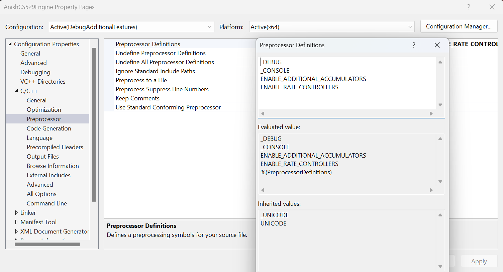

# Extra Features

The engine supports extra features that are being experimented on and aren't
enabled by default.

### Enabling extra features
To enable these features, you must make use of preprocessor definitions.

You can find these under Project -> Properties -> C/C++ -> Preprocessor -> 
Preprocessor Definitions

---

### Supported Features

---

#### ENABLE_ADDITIONAL_ACCUMULATORS

This enables creation of any number of extra accumulators. 

Accumulators get updated on every endFrame() call. It can be used when we
need to know the number of times some logic should run asyncronously.

Enabling additional accumulators adds additional code to the endFrame() logic and
should be used only if needed.

---

#### ENABLE_RATE_CONTROLLERS

This enables creation of any number of rate controllers.

Rate controllers are separate timers that are used to check if at least the
designated rate has elapsed since last successful fire.

This is low budget since it does not get updated every frame, and instead 
only calculates when asked.

Tradeoff: This method has longer calc time during checking, but it has
lesser impact on endFrame().

Possible future development: We could extend this to have a callback function
that we can trigger in the endFrame() loop. This would be very heavy and will
likely interfere with regular functioning of the framerate controller.
